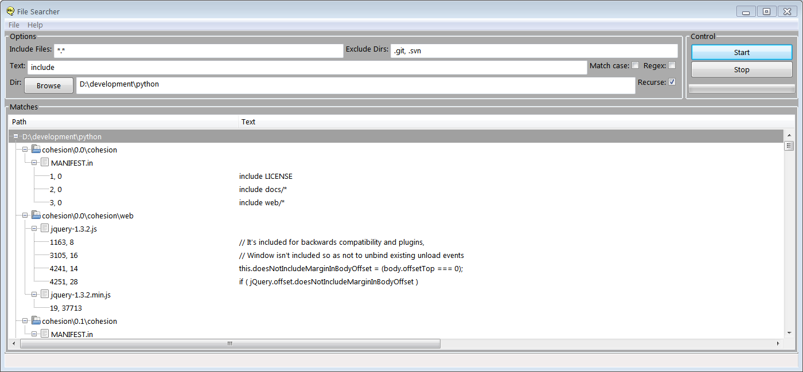

# searcher - GUI file search utility 
This project provides a simple portable GUI-based file search utility. Written in Python 
and using the wxPython GUI toolkit, it runs on most modern operating systems.

## Requirements
The application requires the following software components, and is known to work with the shown versions but may run with earlier ones:
- [Python](http://www.python.org) - 2.7.12
- [wxPython](https://wxpython.org/) - 3.0.2.0
- [PyYAML](http://pyyaml.org/) - 3.12

## Get Started
Clone this repository in the usual way. Execute the file `searcher.pyw` with the UI-based Python interpreter, e.g. `pythonw.exe` on Windows.

## Usage
Use the dialog at the top of the UI to navigate to a folder to search, set a file pattern, set a search text value, and then
press the _Start_ button to commence searching.

Assuming matches are found, they appear in a tree view with three types of entry. Directories are the first type, and have children which are files,
and the files have children which are line matches.

In the results tree, you can select a row and then press _Enter_ to perform the default action for that type of entry,
typically opening the file in your preferred editor.

Similarly, on a results tree row you can click the right-hand mouse button to activate the context (pop-up) menu for that type of entry;
then press _Enter_ for the selected action.  

## Configuration
The application is configured via the file `searcher.yaml` which is a simple [YAML](https://en.wikipedia.org/wiki/YAML) file.
It is organized into sections by operating system, and entries can be customized for user preferences as described therein.

## Development
Note the UI is defined in `searcher.xrc` which is edited with the visual UI tool [XRCEd](https://wiki.wxpython.org/XRCed)
which is part of the standard wx distribution in package `wx.tools.XRCed.xrced`.

## To Do
- Accept command-line argument for initial path
- Match for filename only
- Keyboard accellerators 
- Better icon
- Status bar content

## History
1.0.0 Initial version
